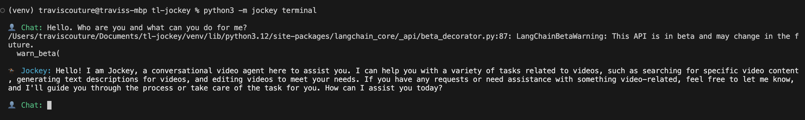
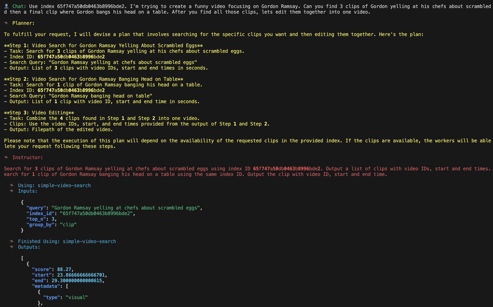
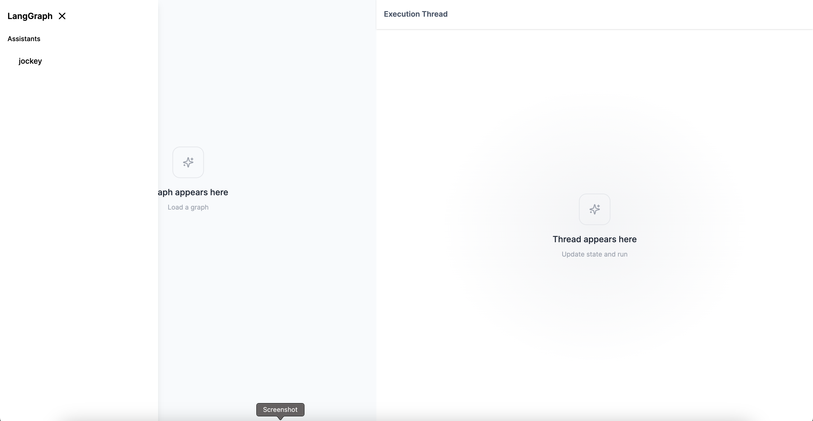
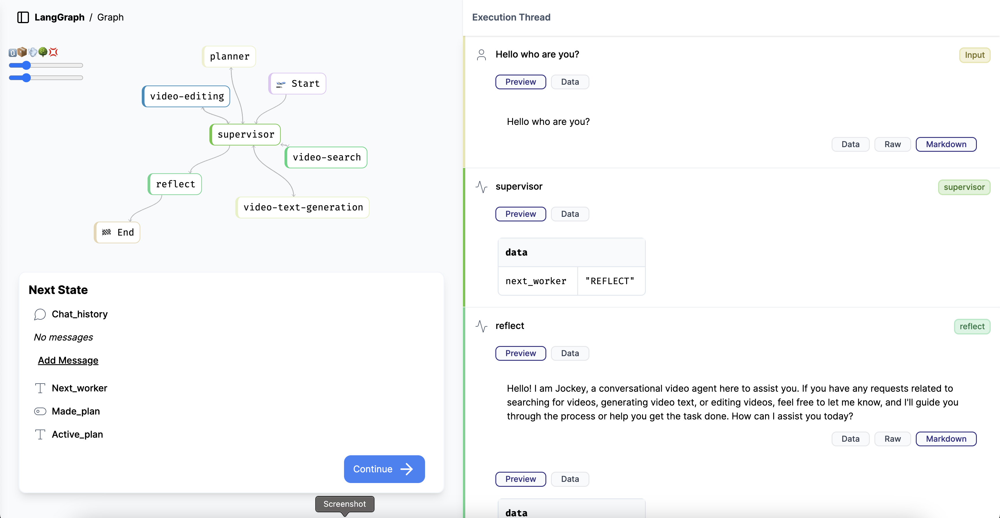

# Jockey

Jockey is a conversational video agent designed for complex video workflows. It combines the following technologies:

- **Twelve Labs Video Understanding Platform**: Offers an [API suite](https://docs.twelvelabs.io/docs/introduction) for integrating  state-of-the-art (“SOTA”) video foundation models (VFMs) that understand contextual information from your videos. The platform works with video natively without the need for intermediary representations like pre-generated captions.
- **Large Language Models (LLMs)**: Logically plan execution steps, interact with users, and pass video-related tasks to the Twelve Labs Video Understanding Platform. LLMs interpret natural language instructions and translate them into actionable tasks.
- **LangGraph**: Orchestrates the interaction between the Twelve Labs API suite and LLMs. [LangGraph](https://python.langchain.com/v0.1/docs/langgraph/) enables the creation of stateful, multi-step applications, allowing for complex video processing workflows.


This allows Jockey to perform accurate video operations based on natural language instructions.

**NOTE**: Jockey is currently in alpha development. It may be unstable or behave unexpectedly. Use caution when implementing Jockey in production environments.

## Key Features

- **Intelligent task allocation**: Jockey efficiently distributes workloads between LLMs for logical planning and user interaction, and VFMs for video understanding.
- **Native video processing**: Unlike systems that rely on pre-generated captions, Jockey works with video content directly, enabling more accurate and nuanced operations.
- **Flexible architecture**: Built on LangGraph, Jockey's modular design allows for easy customization and extension to suit specific use cases.
- **Multiple deployment options**: Supports both terminal-based deployment for quick testing and development, and API server deployment for integration into larger applications.
- **Comprehensive video manipulation**: Capable of tasks such as clip selection, video editing, and content analysis, all driven by natural language instructions.

## Use Cases

Use cases include but are not limited to the following:
- Compiling and editing video clips
- Summarizing videos
- Generating chapters and highlights
- Searching for clips or videos using natural language queries
- Creating custom video compilations based on specific criteria
- Answering questions about video content

## Prerequisites

Ensure the following prerequisites are met before installing and using Jockey.

### System Prerequisites

- Operating System: macOS
- CPU: M1 or newer
- RAM: 8GB minimum

### Software Prerequisites

- **Git**: Any recent version.
    - **Installation instructions**: [Git Downloads](https://git-scm.com/downloads).
    - **Verify the installation**: Run the `git --version` command.
- **Python**: Version 3.11 or higher.
    - **Installation instructions**: [Python Releases for macOS](https://www.python.org/downloads/macos/).
    - **Verify the installation**: Run the `python3 --version` command.
- **FFmpeg**: Must be accessible in your system's `PATH` environment variable.
    - **Installation instructions**: [Download FFmpeg](https://ffmpeg.org/download.html) and add it to the `PATH` environment variable.
    - **Verify the installation**: Run the `ffmpeg -version` command.
- **Docker**: Required for running the Jockey API server.
    - **Installation instructions**: [Get Docker](https://docs.docker.com/get-docker/).
    - **Verify the installation**: Run  the `docker --version` command.
- **Docker Compose V2**: Required for running the Jockey API server.
    - **Installation instructions**: [Overview of installing Docker Compose](https://docs.docker.com/compose/install/).
    - **Verify the installation**: Run the `docker compose version` command.
    If you see a message similar to "docker: 'compose' is not a docker command," you may have v1. To update your Docker Compose version, see the [Migrate to Compose V2](https://docs.docker.com/compose/migrate/) page of the official Docker documentation.

  ### API Keys

- **Twelve Labs API Key**:
    - If you don't have an account, please [sign up](https://playground.twelvelabs.io/) for a free account. Then, to retrieve your API key, go to the [API Key](https://playground.twelvelabs.io/dashboard/api-key) page, and select the **Copy** icon to the right of the key to copy it to your clipboard.
- **LLM Provider API Key**:
    - Jockey supports Azure OpenAI and OpenAI. Retrieve the following based on your chosen provider:
	    - For Azure: Azure OpenAI endpoint, API key, and API version. 
	    - For OpenAI: OpenAI API key.
- **LangGraph API Key**: Required for running the Jockey API server.
 
### Additional Prerequisites

- Familiarity with Python and basic command-line operations is recommended.
- Familiarity with LangGraph is recommended to use Jockey with the LangGraph API server.

## Installation

This section guides you through the process of installing Jockey on your system. Please ensure all the prerequisites are met before proceeding with the installation. If you encounter any issues, please refer to the [Troubleshooting](docs/troubleshooting.md) page or reach out on the [Multimodal Minds Discord](https://discord.gg/4p9QaBvT6r) server for assistance.

### Clone the Repository

Open a terminal, navigate to the directory where you want to install Jockey, and enter the following command:

```sh
git clone https://github.com/twelvelabs-io/tl-jockey.git
```

### Set Up a Python Virtual Environment

1. Create a new virtual environment:
    ```sh
    cd tl-jockey && python3 -m venv venv
    ```
2. Activate your virtual environment:
    ```sh
    source venv/bin/activate
    ```
3. _(Optional)_ Verify that your virtual environment is activated:
    ```sh
    echo $VIRTUAL_ENV
    ```
    The output should display the path to your virtual environment directory, as shown in the example below:
    ```
    /Users/tl/jockey/tl-jockey/venv
    ```
    This indicates that your virtual environment is activated. Your virtual environment is not activated if you see an empty line.
    If this check indicates that your virtual environment is not activated, activate it using the `source venv/bin/activate` command.

### Install Python Dependencies

Install the required Python packages:

```sh
pip3 install -r requirements.txt
```

## Configuration

Jockey uses environment variables for configuration, and comes with an `example.env` file to help you get started.

1. In the `tl-jockey` directory, copy the `example.env` file to a new file named `.env`:
2. Open the newly created `.env` file in a text editor.
3. Replace the placeholders with your actual values. See the tables below for details.

**Common variables**

| Variable              | Description                                                                 | Example         |
| --------------------- | --------------------------------------------------------------------------- | --------------- |
| `TWELVE_LABS_API_KEY` | Your Twelve Labs API key.                                                   | `tlk_987654321` |
| `LLM_PROVIDER`        | The LLM provider you wish to use. Possible values are `AZURE` and `OPENAI`. | `AZURE`         |
| `HOST_PUBLIC_DIR`     | Directory for storing rendered videos                                       | `./output`      |
| `HOST_VECTOR_DB_DIR`  | Directory for vector database storage                                       | `./vector_db`   |

**LLM provider-specific variables**

For Azure OpenAI:

| Variable                   | Description                    | Example                                        |
| -------------------------- | ------------------------------ | ---------------------------------------------- |
| AZURE_OPENAI_ENDPOINT      | Your Azure OpenAI endpoint URL | `https://your-resource-name.openai.azure.com/` |
| AZURE_OPENAI_API_KEY       | Your Azure OpenAI API key      | `987654321`                                    |
| `AZURE_OPENAI_API_VERSION` | The API version you're using   | `2023-12-01-preview`                           |

For OpenAI:

| Variable       | Description         | Example     |
| -------------- | ------------------- | ----------- |
| OPENAI_API_KEY | Your OpenAI API key | `987654321` |


## Usage

This section provides instructions on how to deploy and use Jockey. Follow the steps in one of the following sections, depending on how you wish to deploy and use Jockey - in the terminal or with the LangGraph API server.

### Deploy and use Jockey in the terminal

The terminal deployment is ideal for quick testing, development work, and debugging. It provides immediate feedback and allows for easy interaction with Jockey.

[Terminal Example Jockey Video Walkthrough](https://www.loom.com/share/91f9745affbc4967b0f0d502c073d6a7?sid=344ad4e3-809f-489f-aaea-4798e30ccc50)

1. Activate your virtual environment:
    ```sh
    source venv/bin/activate
    ```
2. Run the following command:
    ```sh
    python3 -m jockey terminal
    ```
    
3. Jockey will initialize and display a startup message. Wait for the prompt indicating it's ready for input.
4. Once Jockey is ready, you can start interacting with it using natural language commands.
    Begin by providing and index id in your initial prompt, as shown in the example below:
    ```
    Use index 65f747a50db0463b8996bde2. I'm trying to create a funny video focusing on Gordon Ramsay. Can you find 3 clips of Gordon yelling at his chefs about scrambled eggs and then a final clip where Gordon bangs his head on a table. After you find all those clips, lets edit them together into one video.
    ```
    Note that in some cases, such as summarizing videos or generating chapters and highlights, you must also provide a video ID.
    You can continue the conversation by providing new instructions or asking questions, as shown in the following example:
    ```
    This is awesome but the last clip is too long. Lets shorten the last clip where Gordon hits his head on the table by making it start one second later. Then combine all the clips into a single video again.
    ```
 6. When you've finished, exit terminal mode using the `Ctrl+C` keyboard shortcut.

 #### Debug in the Terminal

The terminal version of Jockey provides verbose output for debugging purposes:
- The outputs from all of the individual components are displayed.
- Tool calls and their results are also displayed.



To adjust the verbosity of the output, modify the [`parse_langchain_events_terminal()`](jockey/util.py#L31) function in `jockey/util.py`.

Note that the tags for the individual components are set in [app.py](jockey/app.py).

### Deploy and Use Jockey with the LangGraph API Server

The LangGraph API Server deployment is suitable for building end-to-end user applications.

1. Activate your virtual environment:
    ```sh
    source venv/bin/activate
    ```
2. Run the command below and wait for the message indicating that the server is running. By default, it will be available at [http://localhost:8124](http://localhost:8124):
    ```sh
    python3 -m jockey server
    ```
3. Once the server is running, you can interact with Jockey using HTTP requests or the [LangGraph Python SDK](https://pypi.org/project/langgraph-sdk/).

#### Debug using the LangGraph Debugger

The LangGraph API Server includes a debugger that you can use for monitoring and debugging Jockey:

1. Open a web browser and navigate to [http://localhost:8124](http://localhost:8124).
    
2. Select "jockey" under the "Assistants" section.
3. Click "New Thread" to start a new conversation with Jockey.
4. Use the debugger to step into the Jockey instance. You can add breakpoints to examine and validate the graph state for any given input.
    

[LangGraph Debugger UI Walkthrough](https://www.loom.com/share/9b7594df37294edcaed31a4b2d901d7b?sid=28a9019d-0ac4-4ca6-a874-d334e2ab1221).

## Integrate Jockey Into Your Application

To integrate Jockey into your application, use an HTTP client library or the [LangGraph Python SDK](https://pypi.org/project/langgraph-sdk/).

For a basic example of how to interact with Jockey programmatically, refer to the [client.ipynb](client.ipynb) Jupyter notebook in the project repository. For more detailed information, see the [LangGraph Examples](https://github.com/langchain-ai/langgraph-example) page. 


## Additional documentation

- [Troubleshooting](docs/troubleshooting.md)
- [Support](docs/support.md)
- [Architecture](docs/architecture.md)
- [Customize Jockey](docs/customize-jockey.md)